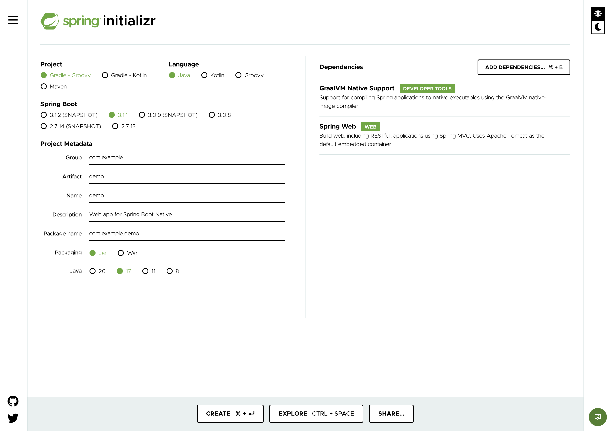
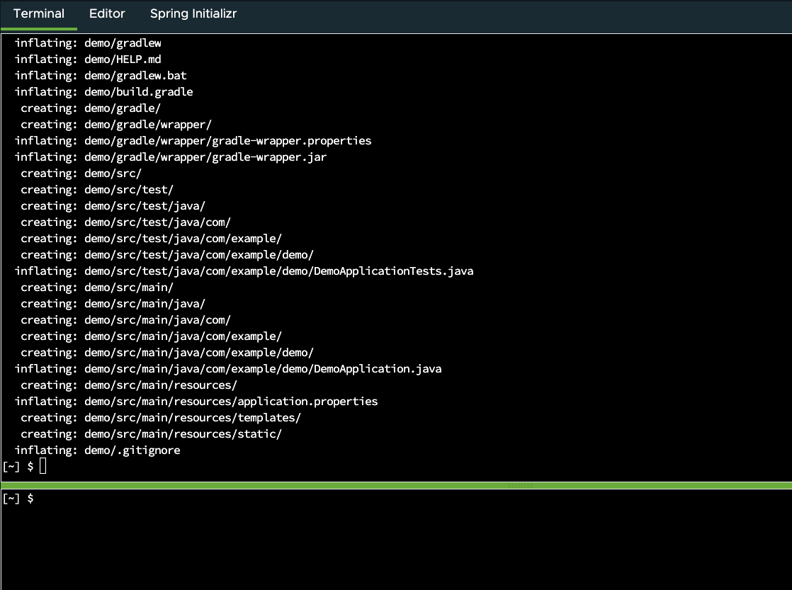

We'll start by generating a complete codebase that's Native-Image-ready. To start, open the **_Spring Initializr_** Web UI.

- In this Lab, it's in a tab over to the right, in this very browser window. **(Look right →)**, and you will find the **Spring Initializr** Tab.
  > **_Note_**: When you are not using this Spring Academy browser-based Lab environment, the same Initializr web site can be found at [start.spring.io](https://start.spring.io/).

You don't need to make any changes on the _Project_,
_Language_, _Spring Boot_ or _Project Metadata_ sections of the Initializr web page.
The default settings produce a complete application.

On the _Dependencies_ section you must add two dependencies.
Using the **ADD DEPENDENCIES...** button in the upper right,
or alternatively the **ADD...** button in the lower right on smaller screens,
select the following two dependencies.
You can find them by scrolling through the choices, or searching by name:

- **GraalVM Native Support**
- **Spring Web**

After you have selected the two required dependencies, go ahead and click the **CREATE...** button at the bottom of the screen.

You'll notice that the **Terminal** tab has been automatically selected, _and_ a file called `demo.zip` was automatically downloaded and unzipped. In the Terminal tab to the right you should see output similar to the following:

The new `demo` directory contains a complete, ready-to-run Spring Boot application:

- It's a web application, because you selected the **Spring Web** dependency.
- It's ready to be built into a native image, because you selected the **GraalVM Native Support** dependency.
